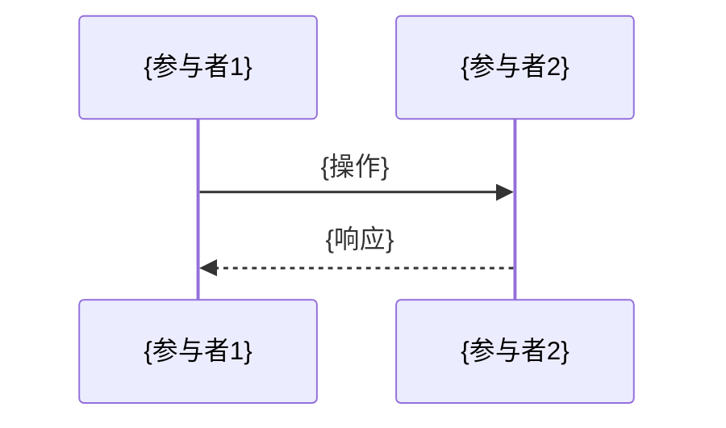

# 架构设计文档模板

---

## 基本信息

| 字段 | 内容 |
|------|------|
| 模块名称 | {Module Name} |
| 版本 | v{version} |
| 作者 | {Author} |
| 日期 | {YYYY-MM-DD} |
| 状态 | draft/review/approved |

---

## 1. 概述

### 1.1 功能概述
{简要描述模块功能}

### 1.2 设计目标
- {目标1}
- {目标2}

### 1.3 适用范围
{描述适用场景}

---

## 2. 系统架构

### 2.1 架构图

```mermaid
{架构图 - 使用 Mermaid 语法}
```

### 2.2 模块结构

```
{模块目录结构}
```

### 2.3 组件说明

| 组件 | 职责 | 依赖 |
|------|------|------|
| {组件1} | {职责} | {依赖} |
| {组件2} | {职责} | {依赖} |

---

## 3. 接口设计

### 3.1 接口列表

| 接口 | 类型 | 说明 |
|------|------|------|
| {接口1} | {类型} | {说明} |

### 3.2 接口详情

#### {接口名称}

**请求**:
```json
{
  "field1": "type",
  "field2": "type"
}
```

**响应**:
```json
{
  "field1": "type",
  "field2": "type"
}
```

**错误码**:
| 错误码 | 说明 |
|--------|------|
| {错误码} | {说明} |

---

## 4. 数据模型

### 4.1 实体设计

| 字段 | 类型 | 说明 |
|------|------|------|
| {字段} | {类型} | {说明} |

### 4.2 关系图

```mermaid
erDiagram
    {Entity1} ||--o{ {Entity2} : "关系"
```

---

## 5. 技术决策

| 决策点 | 选项 | 选择 | 理由 |
|--------|------|------|------|
| {决策} | A/B/C | {选择} | {理由} |

---

## 6. 时序图



---

## 7. 部署方案

### 7.1 部署架构
{描述部署架构}

### 7.2 环境配置
| 环境 | 配置 |
|------|------|
| Dev | {配置} |
| Staging | {配置} |
| Production | {配置} |

---

## 8. 监控告警

### 8.1 监控指标
| 指标 | 阈值 | 告警级别 |
|------|------|----------|
| {指标} | {阈值} | {级别} |

### 8.2 日志规范
{日志规范说明}

---

## 9. 安全性

### 9.1 认证授权
{认证授权说明}

### 9.2 数据安全
{数据安全说明}

---

## 10. 性能考虑

### 10.1 性能指标
| 指标 | 目标值 |
|------|--------|
| {指标} | {值} |

### 10.2 优化策略
- {策略1}
- {策略2}

---

## 11. 风险评估

| 风险 | 影响 | 概率 | 应对 |
|------|------|------|------|
| {风险} | {影响} | {概率} | {应对} |

---

## 12. 评审记录

| 评审日期 | 评审人 | 意见 | 状态 |
|----------|--------|------|------|
| {日期} | {人} | {意见} | {状态} |

---

## 13. 变更记录

| 版本 | 日期 | 修改人 | 变更内容 |
|------|------|--------|----------|
| v1.0 | {日期} | {人} | {内容} |
